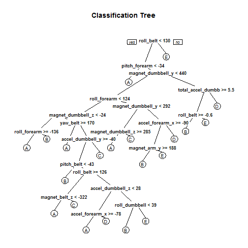
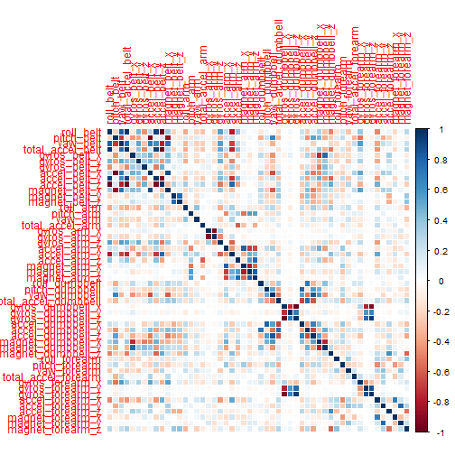

## Background  
Using devices such as Jawbone Up, Nike FuelBand, and Fitbit it is now possible to collect a large amount of data about personal activity relatively inexpensively. These type of devices are part of the quantified self movement -- a group of enthusiasts who take measurements about themselves regularly to improve their health, to find patterns in their behavior, or because they are tech geeks. One thing that people regularly do is quantify how much of a particular activity they do, but they rarely quantify how well they do it.  

In this project, we will use data from accelerometers on the belt, forearm, arm, and dumbell of 6 participants to predict how well they perform the exercise, in five different fashions: exactly according to the specification (Class A), throwing the elbows to the front (Class B), lifting the dumbbell only halfway (Class C), lowering the dumbbell only halfway (Class D) and throwing the hips to the front (Class E).

The Weight Lifting Exercise dataset is collected from this publication: Qualitative Activity Recognition of Weight Lifting Exercises. Read more: http://groupware.les.inf.puc-rio.br/har#ixzz3dHPxndLC

### Download packages 

```r
# install.packages("caret")
# install.packages("rpart")
# install.packages("rpart.plot")
# install.packages("randomForest")
# install.packages("corrplot")
# install.packages("e1071")
```
### Download the training and testing datasets

```r
trainUrl = "http://d396qusza40orc.cloudfront.net/predmachlearn/pml-training.csv"
testUrl = "http://d396qusza40orc.cloudfront.net/predmachlearn/pml-testing.csv"
trainFile = "./data/pml-training.csv"
testFile  = "./data/pml-testing.csv"
if (!file.exists("./data")) {
  dir.create("./data")
}
if (!file.exists(trainFile)) {
  download.file(trainUrl, destfile=trainFile)
}
if (!file.exists(testFile)) {
  download.file(testUrl, destfile=testFile)
}
```
### Loading the dataset into data frames
After downloading the data from the data source, we can read the two csv files into two data frames.  

```r
trainRaw = read.csv("./data/pml-training.csv")
testRaw = read.csv("./data/pml-testing.csv")
dim(trainRaw)
```

```
## [1] 19622   160
```

```r
dim(testRaw)
```

```
## [1]  20 160
```
The training dataset contains 19622 observations and 160 variables, while the testing dataset contains 20 observations and 160 variables. The "classe" variable in the training set is the outcome (manner in which the participants did the exercise) to predict. 

### Data processing
In this step, we will clean the data and remove observations with missing values as well as some meaningless variables.

```r
sum(complete.cases(trainRaw))
```

```
## [1] 406
```
There are only 406 records with no missing values out of 19622 records!

First, we remove columns that contain NA missing values.

```r
trainRaw = trainRaw[, colSums(is.na(trainRaw)) == 0] 
dim(trainRaw)
```

```
## [1] 19622    93
```

```r
testRaw = testRaw[, colSums(is.na(testRaw)) == 0] 
dim(testRaw)
```

```
## [1] 20 60
```
Next, we get rid of some columns that do not contribute much to the accelerometer measurements.

```r
classe = trainRaw$classe # A, B, C, D, E, (extract out first as we do not want to convert this to numeric)
head(trainRaw,1)
```

```
##   X user_name raw_timestamp_part_1 raw_timestamp_part_2   cvtd_timestamp
## 1 1  carlitos           1323084231               788290 05/12/2011 11:23
##   new_window num_window roll_belt pitch_belt yaw_belt total_accel_belt
## 1         no         11      1.41       8.07    -94.4                3
##   kurtosis_roll_belt kurtosis_picth_belt kurtosis_yaw_belt
## 1                                                         
##   skewness_roll_belt skewness_roll_belt.1 skewness_yaw_belt max_yaw_belt
## 1                                                                       
##   min_yaw_belt amplitude_yaw_belt gyros_belt_x gyros_belt_y gyros_belt_z
## 1                                            0            0        -0.02
##   accel_belt_x accel_belt_y accel_belt_z magnet_belt_x magnet_belt_y
## 1          -21            4           22            -3           599
##   magnet_belt_z roll_arm pitch_arm yaw_arm total_accel_arm gyros_arm_x
## 1          -313     -128      22.5    -161              34           0
##   gyros_arm_y gyros_arm_z accel_arm_x accel_arm_y accel_arm_z magnet_arm_x
## 1           0       -0.02        -288         109        -123         -368
##   magnet_arm_y magnet_arm_z kurtosis_roll_arm kurtosis_picth_arm
## 1          337          516                                     
##   kurtosis_yaw_arm skewness_roll_arm skewness_pitch_arm skewness_yaw_arm
## 1                                                                       
##   roll_dumbbell pitch_dumbbell yaw_dumbbell kurtosis_roll_dumbbell
## 1      13.05217        -70.494    -84.87394                       
##   kurtosis_picth_dumbbell kurtosis_yaw_dumbbell skewness_roll_dumbbell
## 1                                                                     
##   skewness_pitch_dumbbell skewness_yaw_dumbbell max_yaw_dumbbell
## 1                                                               
##   min_yaw_dumbbell amplitude_yaw_dumbbell total_accel_dumbbell
## 1                                                           37
##   gyros_dumbbell_x gyros_dumbbell_y gyros_dumbbell_z accel_dumbbell_x
## 1                0            -0.02                0             -234
##   accel_dumbbell_y accel_dumbbell_z magnet_dumbbell_x magnet_dumbbell_y
## 1               47             -271              -559               293
##   magnet_dumbbell_z roll_forearm pitch_forearm yaw_forearm
## 1               -65         28.4         -63.9        -153
##   kurtosis_roll_forearm kurtosis_picth_forearm kurtosis_yaw_forearm
## 1                                                                  
##   skewness_roll_forearm skewness_pitch_forearm skewness_yaw_forearm
## 1                                                                  
##   max_yaw_forearm min_yaw_forearm amplitude_yaw_forearm
## 1                                                      
##   total_accel_forearm gyros_forearm_x gyros_forearm_y gyros_forearm_z
## 1                  36            0.03               0           -0.02
##   accel_forearm_x accel_forearm_y accel_forearm_z magnet_forearm_x
## 1             192             203            -215              -17
##   magnet_forearm_y magnet_forearm_z classe
## 1              654              476      A
```

```r
#returns true/false for columns that contains these, these fields are numeric/integer as well 
#which we do not need
trainRemove = grepl("^X|timestamp|window", names(trainRaw)) 
trainRaw = trainRaw[, !trainRemove] 
#retain only those columns which does not match above words !FALSE = TRUE
head(trainRaw, 1)
```

```
##   user_name roll_belt pitch_belt yaw_belt total_accel_belt
## 1  carlitos      1.41       8.07    -94.4                3
##   kurtosis_roll_belt kurtosis_picth_belt kurtosis_yaw_belt
## 1                                                         
##   skewness_roll_belt skewness_roll_belt.1 skewness_yaw_belt max_yaw_belt
## 1                                                                       
##   min_yaw_belt amplitude_yaw_belt gyros_belt_x gyros_belt_y gyros_belt_z
## 1                                            0            0        -0.02
##   accel_belt_x accel_belt_y accel_belt_z magnet_belt_x magnet_belt_y
## 1          -21            4           22            -3           599
##   magnet_belt_z roll_arm pitch_arm yaw_arm total_accel_arm gyros_arm_x
## 1          -313     -128      22.5    -161              34           0
##   gyros_arm_y gyros_arm_z accel_arm_x accel_arm_y accel_arm_z magnet_arm_x
## 1           0       -0.02        -288         109        -123         -368
##   magnet_arm_y magnet_arm_z kurtosis_roll_arm kurtosis_picth_arm
## 1          337          516                                     
##   kurtosis_yaw_arm skewness_roll_arm skewness_pitch_arm skewness_yaw_arm
## 1                                                                       
##   roll_dumbbell pitch_dumbbell yaw_dumbbell kurtosis_roll_dumbbell
## 1      13.05217        -70.494    -84.87394                       
##   kurtosis_picth_dumbbell kurtosis_yaw_dumbbell skewness_roll_dumbbell
## 1                                                                     
##   skewness_pitch_dumbbell skewness_yaw_dumbbell max_yaw_dumbbell
## 1                                                               
##   min_yaw_dumbbell amplitude_yaw_dumbbell total_accel_dumbbell
## 1                                                           37
##   gyros_dumbbell_x gyros_dumbbell_y gyros_dumbbell_z accel_dumbbell_x
## 1                0            -0.02                0             -234
##   accel_dumbbell_y accel_dumbbell_z magnet_dumbbell_x magnet_dumbbell_y
## 1               47             -271              -559               293
##   magnet_dumbbell_z roll_forearm pitch_forearm yaw_forearm
## 1               -65         28.4         -63.9        -153
##   kurtosis_roll_forearm kurtosis_picth_forearm kurtosis_yaw_forearm
## 1                                                                  
##   skewness_roll_forearm skewness_pitch_forearm skewness_yaw_forearm
## 1                                                                  
##   max_yaw_forearm min_yaw_forearm amplitude_yaw_forearm
## 1                                                      
##   total_accel_forearm gyros_forearm_x gyros_forearm_y gyros_forearm_z
## 1                  36            0.03               0           -0.02
##   accel_forearm_x accel_forearm_y accel_forearm_z magnet_forearm_x
## 1             192             203            -215              -17
##   magnet_forearm_y magnet_forearm_z classe
## 1              654              476      A
```

```r
dim(trainRaw)
```

```
## [1] 19622    87
```

```r
trainCleaned = trainRaw[, sapply(trainRaw, is.numeric)] #extract & retain only those cols that are numeric/integer
dim(trainCleaned)
```

```
## [1] 19622    52
```

```r
trainCleaned$classe = classe #add back the original classe column
dim(trainCleaned)
```

```
## [1] 19622    53
```

```r
#testRaw does not have classe variable, but has an additional problem_id variable from 1 to 20
#returns true/false for columns that contains these, these fields are numeric/integer as well 
#which we do not need
head(testRaw,1)
```

```
##   X user_name raw_timestamp_part_1 raw_timestamp_part_2   cvtd_timestamp
## 1 1     pedro           1323095002               868349 05/12/2011 14:23
##   new_window num_window roll_belt pitch_belt yaw_belt total_accel_belt
## 1         no         74       123         27    -4.75               20
##   gyros_belt_x gyros_belt_y gyros_belt_z accel_belt_x accel_belt_y
## 1         -0.5        -0.02        -0.46          -38           69
##   accel_belt_z magnet_belt_x magnet_belt_y magnet_belt_z roll_arm
## 1         -179           -13           581          -382     40.7
##   pitch_arm yaw_arm total_accel_arm gyros_arm_x gyros_arm_y gyros_arm_z
## 1     -27.8     178              10       -1.65        0.48       -0.18
##   accel_arm_x accel_arm_y accel_arm_z magnet_arm_x magnet_arm_y
## 1          16          38          93         -326          385
##   magnet_arm_z roll_dumbbell pitch_dumbbell yaw_dumbbell
## 1          481     -17.73748       24.96085      126.236
##   total_accel_dumbbell gyros_dumbbell_x gyros_dumbbell_y gyros_dumbbell_z
## 1                    9             0.64             0.06            -0.61
##   accel_dumbbell_x accel_dumbbell_y accel_dumbbell_z magnet_dumbbell_x
## 1               21              -15               81               523
##   magnet_dumbbell_y magnet_dumbbell_z roll_forearm pitch_forearm
## 1              -528               -56          141          49.3
##   yaw_forearm total_accel_forearm gyros_forearm_x gyros_forearm_y
## 1         156                  33            0.74           -3.34
##   gyros_forearm_z accel_forearm_x accel_forearm_y accel_forearm_z
## 1           -0.59            -110             267            -149
##   magnet_forearm_x magnet_forearm_y magnet_forearm_z problem_id
## 1             -714              419              617          1
```

```r
testRemove = grepl("^X|timestamp|window", names(testRaw)) 
testRaw = testRaw[, !testRemove]  
#retain only those columns which does not match above words !FALSE = TRUE
head(testRaw,1)
```

```
##   user_name roll_belt pitch_belt yaw_belt total_accel_belt gyros_belt_x
## 1     pedro       123         27    -4.75               20         -0.5
##   gyros_belt_y gyros_belt_z accel_belt_x accel_belt_y accel_belt_z
## 1        -0.02        -0.46          -38           69         -179
##   magnet_belt_x magnet_belt_y magnet_belt_z roll_arm pitch_arm yaw_arm
## 1           -13           581          -382     40.7     -27.8     178
##   total_accel_arm gyros_arm_x gyros_arm_y gyros_arm_z accel_arm_x
## 1              10       -1.65        0.48       -0.18          16
##   accel_arm_y accel_arm_z magnet_arm_x magnet_arm_y magnet_arm_z
## 1          38          93         -326          385          481
##   roll_dumbbell pitch_dumbbell yaw_dumbbell total_accel_dumbbell
## 1     -17.73748       24.96085      126.236                    9
##   gyros_dumbbell_x gyros_dumbbell_y gyros_dumbbell_z accel_dumbbell_x
## 1             0.64             0.06            -0.61               21
##   accel_dumbbell_y accel_dumbbell_z magnet_dumbbell_x magnet_dumbbell_y
## 1              -15               81               523              -528
##   magnet_dumbbell_z roll_forearm pitch_forearm yaw_forearm
## 1               -56          141          49.3         156
##   total_accel_forearm gyros_forearm_x gyros_forearm_y gyros_forearm_z
## 1                  33            0.74           -3.34           -0.59
##   accel_forearm_x accel_forearm_y accel_forearm_z magnet_forearm_x
## 1            -110             267            -149             -714
##   magnet_forearm_y magnet_forearm_z problem_id
## 1              419              617          1
```

```r
dim(testRaw)
```

```
## [1] 20 54
```

```r
testCleaned = testRaw[, sapply(testRaw, is.numeric)] #extract & retain only those cols that are numeric/integer
dim(testCleaned) #username removed
```

```
## [1] 20 53
```
Now, the cleaned training dataset contains 19622 observations and 53 variables, while the cleaned testing dataset contains 20 observations and 53 variables. The "classe" variable is still in the cleaned training set.

### Data Slicing
We split the cleaned training set into a pure training dataset (70%) and a validation dataset (30%). 
We will use the validation dataset to conduct cross validation in later part of the steps.  
Refer to Appendix to see the Correlation of each variable with all other variables in the training dataset.

```r
set.seed(123) # For reproducibility
library(caret)
```

```
## Warning: package 'caret' was built under R version 3.1.3
```

```
## Loading required package: lattice
## Loading required package: ggplot2
```

```r
inTrain = createDataPartition(trainCleaned$classe, p=0.70, list=F)
trainData = trainCleaned[inTrain, ]
testData = trainCleaned[-inTrain, ]
```
### Using Machine Learning Algo: Decision Tree for prediction
We use the **Decision Tree** model to perform prediction.

```r
library(rpart)
```

```
## Warning: package 'rpart' was built under R version 3.1.3
```

```r
treemodel = rpart(classe ~., data=trainData, method="class")
```
Then, we estimate the performance of the model on the validation dataset.  

```r
predicttree = predict(treemodel, testData, type="class") #5885 results
length(predicttree)
```

```
## [1] 5885
```

```r
head(predicttree,3)
```

```
## 1 2 5 
## A A A 
## Levels: A B C D E
```

```r
#plot the tree
library(rpart.plot)
```

```
## Warning: package 'rpart.plot' was built under R version 3.1.3
```

```r
rpart.plot(treemodel, main="Classification Tree", faclen=0)  # faclen=0 to print full factor names
```

 

```r
#alternative method to plot
#prp(treemodel)
confusionMatrix(testData$classe, predicttree)
```

```
## Confusion Matrix and Statistics
## 
##           Reference
## Prediction    A    B    C    D    E
##          A 1530   49   33   32   30
##          B  214  693  111   65   56
##          C   73   89  769   65   30
##          D  131   95  149  504   85
##          E   55  102  111   44  770
## 
## Overall Statistics
##                                           
##                Accuracy : 0.7249          
##                  95% CI : (0.7133, 0.7363)
##     No Information Rate : 0.3404          
##     P-Value [Acc > NIR] : < 2.2e-16       
##                                           
##                   Kappa : 0.6493          
##  Mcnemar's Test P-Value : < 2.2e-16       
## 
## Statistics by Class:
## 
##                      Class: A Class: B Class: C Class: D Class: E
## Sensitivity            0.7639   0.6741   0.6556  0.70986   0.7930
## Specificity            0.9629   0.9082   0.9455  0.91111   0.9365
## Pos Pred Value         0.9140   0.6084   0.7495  0.52282   0.7116
## Neg Pred Value         0.8877   0.9294   0.9169  0.95814   0.9582
## Prevalence             0.3404   0.1747   0.1993  0.12065   0.1650
## Detection Rate         0.2600   0.1178   0.1307  0.08564   0.1308
## Detection Prevalence   0.2845   0.1935   0.1743  0.16381   0.1839
## Balanced Accuracy      0.8634   0.7911   0.8005  0.81049   0.8648
```

```r
accuracy1 = postResample(predicttree, testData$classe)
accuracy1
```

```
##  Accuracy     Kappa 
## 0.7248938 0.6493356
```

```r
oose1 = 1 - as.numeric(confusionMatrix(testData$classe, predicttree)$overall[1])
oose1
```

```
## [1] 0.2751062
```
From the confusion matrix, the estimated accuracy of the model is 72.4% and the estimated out-of-sample error is 0.28%.

### Using Machine Learning Algo: Random Forest for prediction
We fit a predictive model for activity recognition using **Random Forest** algorithm because it automatically selects important variables and is robust to correlated covariates & outliers in general. We will use **3-fold cross validation** when applying the algorithm.  

```r
controlRf = trainControl(method="cv", 3)
library(randomForest)
```

```
## Warning: package 'randomForest' was built under R version 3.1.3
```

```
## randomForest 4.6-10
## Type rfNews() to see new features/changes/bug fixes.
```

```r
#modelRf = train(classe ~ ., data=trainData, method="rf", trControl=controlRf, ntree=50)
modelRf = randomForest(classe ~ ., data=trainData, ntree=250, trControl=controlRf)
modelRf
```

```
## 
## Call:
##  randomForest(formula = classe ~ ., data = trainData, ntree = 250,      trControl = controlRf) 
##                Type of random forest: classification
##                      Number of trees: 250
## No. of variables tried at each split: 7
## 
##         OOB estimate of  error rate: 0.52%
## Confusion matrix:
##      A    B    C    D    E  class.error
## A 3904    1    0    0    1 0.0005120328
## B   13 2640    4    1    0 0.0067720090
## C    0   12 2379    5    0 0.0070951586
## D    0    0   25 2225    2 0.0119893428
## E    0    0    2    5 2518 0.0027722772
```
Then, we estimate the performance of the model on the validation dataset.  

```r
predictRf = predict(modelRf, testData)
#predictRf
confusionMatrix(testData$classe, predictRf)
```

```
## Confusion Matrix and Statistics
## 
##           Reference
## Prediction    A    B    C    D    E
##          A 1674    0    0    0    0
##          B    1 1138    0    0    0
##          C    0    9 1017    0    0
##          D    0    0   17  947    0
##          E    0    0    0    1 1081
## 
## Overall Statistics
##                                           
##                Accuracy : 0.9952          
##                  95% CI : (0.9931, 0.9968)
##     No Information Rate : 0.2846          
##     P-Value [Acc > NIR] : < 2.2e-16       
##                                           
##                   Kappa : 0.994           
##  Mcnemar's Test P-Value : NA              
## 
## Statistics by Class:
## 
##                      Class: A Class: B Class: C Class: D Class: E
## Sensitivity            0.9994   0.9922   0.9836   0.9989   1.0000
## Specificity            1.0000   0.9998   0.9981   0.9966   0.9998
## Pos Pred Value         1.0000   0.9991   0.9912   0.9824   0.9991
## Neg Pred Value         0.9998   0.9981   0.9965   0.9998   1.0000
## Prevalence             0.2846   0.1949   0.1757   0.1611   0.1837
## Detection Rate         0.2845   0.1934   0.1728   0.1609   0.1837
## Detection Prevalence   0.2845   0.1935   0.1743   0.1638   0.1839
## Balanced Accuracy      0.9997   0.9960   0.9909   0.9978   0.9999
```

```r
accuracy2 = postResample(predictRf, testData$classe)
accuracy2
```

```
##  Accuracy     Kappa 
## 0.9952421 0.9939814
```

```r
oose2 = 1 - as.numeric(confusionMatrix(testData$classe, predictRf)$overall[1])
oose2
```

```
## [1] 0.004757859
```
From the confusion matrix, the estimated accuracy of the model is 99.4% and the estimated out-of-sample error is 0.56%.

### Comparing Decision Tree Model and Random Forest Model
We can tell from the confusion matrix results, the Random Forest Algorithm performed better than the Decision Tree Algorithm. The model accuracy for Random Forest was 99.4% (95% CI: 99.21%, 99.61%) compared to Decision Tree accuracy at 72.4% (95% CI 71.24%, 73.54%). Therefore, Random Forest is chosen. Our test dataset comprises 20 test case; with an accuracy rate of 99.4% on our cross-validation data, we can expect that very few or none of the test samples will be missclassified.

### Predicting the Test Dataset
Now, we apply the Random Forest model to the original test dataset downloaded from the data source. We remove the `problem_id` column which is the last column i.e. also = length of the dataframe, or ncol of dataframe.  


```r
result = predict(modelRf, testCleaned[, -ncol(testCleaned)])
result
```

```
##  1  2  3  4  5  6  7  8  9 10 11 12 13 14 15 16 17 18 19 20 
##  B  A  B  A  A  E  D  B  A  A  B  C  B  A  E  E  A  B  B  B 
## Levels: A B C D E
```

```r
#write files for submission
#create problem results folder
if (!file.exists("./problem_results")) {
  dir.create("./problem_results")
}

#store all problem id_1 to _20 txt files. and write the result to the content of the text file.
pml_write_files = function(x){
  n = length(x)
  for(i in 1:n){
    filename = paste0("problem_results/problem_id_",i,".txt")
    write.table(x[i], file=filename, quote=FALSE,
                row.names=FALSE, col.names=FALSE)
  }
}
pml_write_files(result)
```

### Appendix: Figure
Correlation Matrix Visualization  

```r
library(corrplot)
```

```
## Warning: package 'corrplot' was built under R version 3.1.3
```

```r
#last col of trainData is classe, remove that
corrPlot = cor(trainData[, -ncol(trainData)])
corrplot(corrPlot, method="color")
```

 
